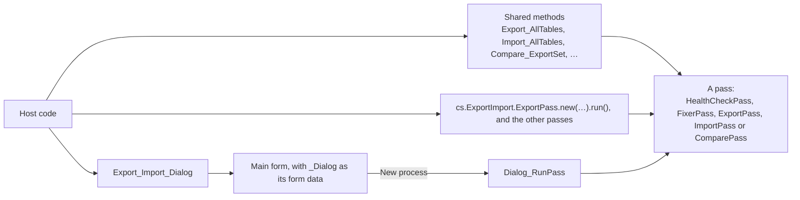
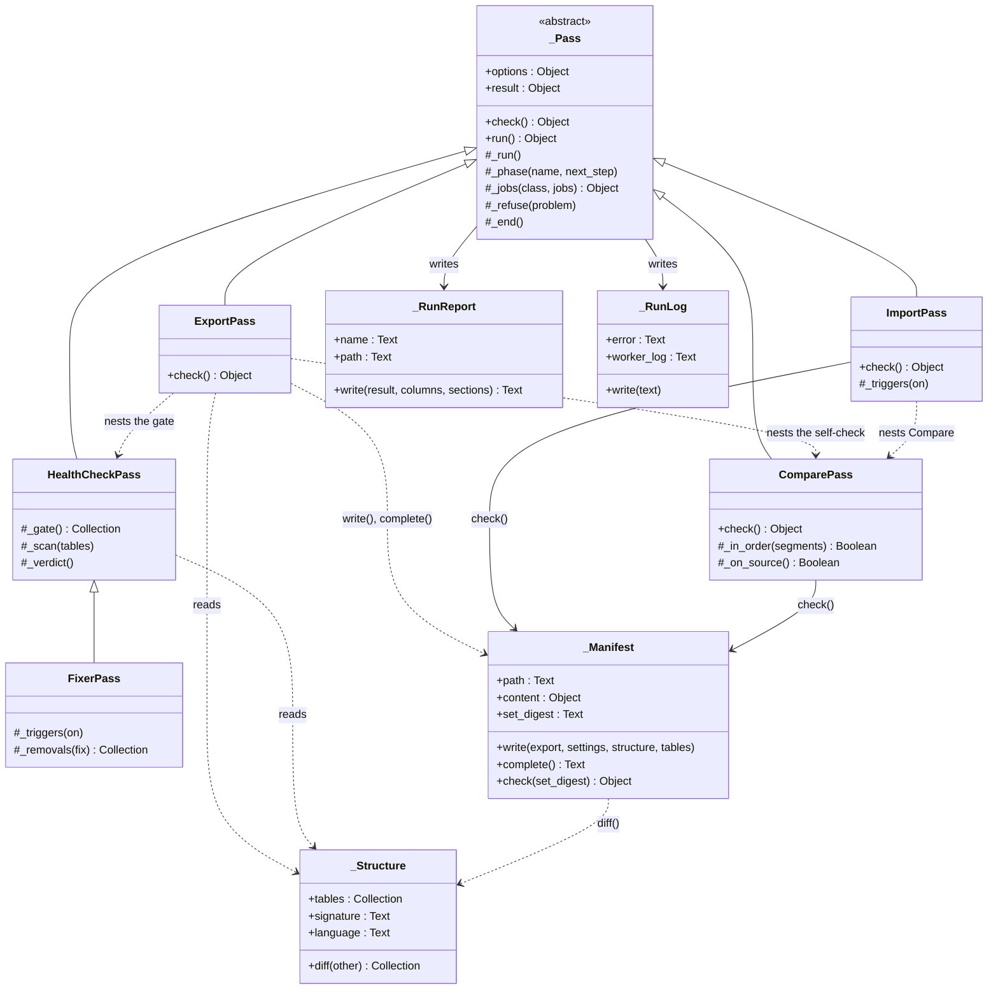
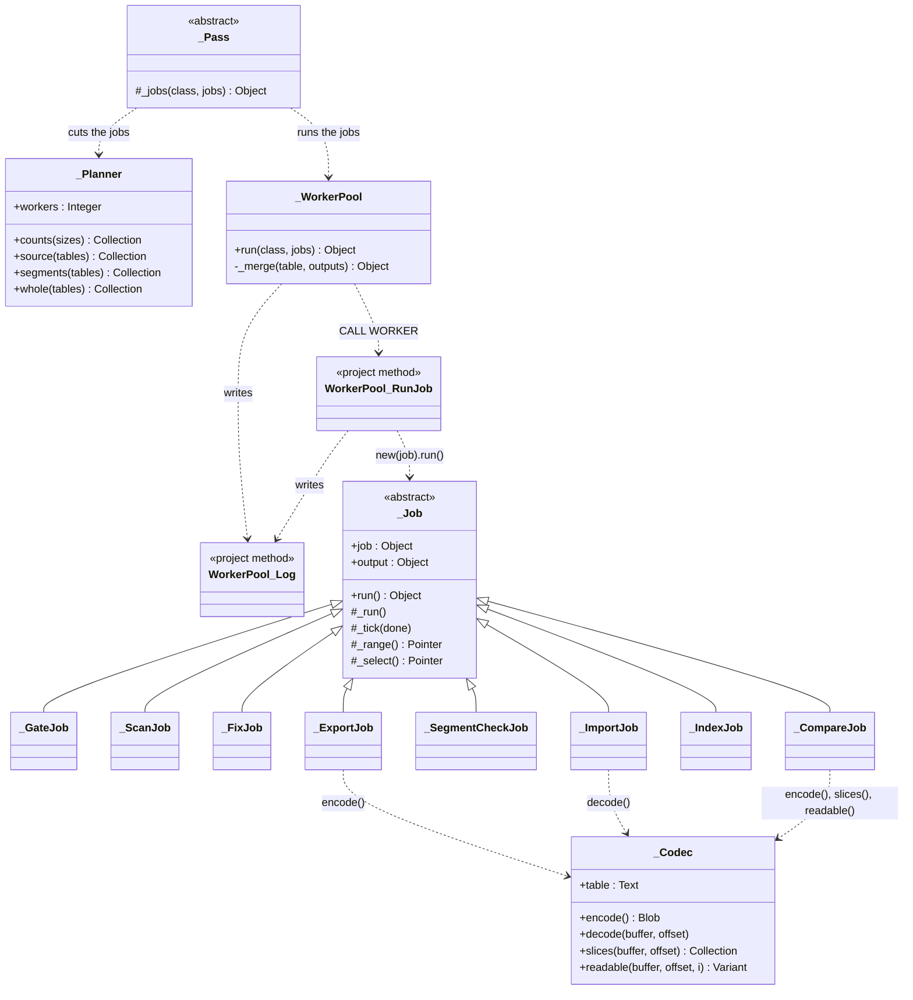

# How ExportImport works

This page explains how the component is built: its classes, how a run moves through its phases,
and how the record work is shared out across worker processes. It is for developers who maintain
the component, or who call it from a host and want to know what happens inside a run. It assumes
you know 4D's processes, `CALL WORKER`, preemptive mode and ORDA.

For what the component is for, read the [overview](overview.md) first. For the files a run
writes, see [Export set and run file formats](file-formats.md). The terms are defined in the
[glossary](../GLOSSARY.md).

## The way in: three entry points, one set of passes

A host reaches the component in three ways. All three end in the same **pass** classes, each with a
`check()` and a `run()`.

- **The shared methods** are one-line wrappers over a pass. They keep the names and parameters of
  earlier versions, so most return a path, not the result.
- **The `ExportImport` namespace** gives the host the pass classes themselves, and `run()` returns
  the full result object.
- **The dialog** builds the same passes and runs them in their own process, `Dialog_RunPass`.

[ADR 0001](adr/0001-two-host-seams.md) records why there are two code seams. Every class or
function whose name starts with `_` is internal. A host can still call it, but it is outside the
compatibility promise.

## The class diagrams

The first diagram shows the passes and the classes they work with. Five public pass classes extend
the internal base class `_Pass`. `FixerPass` extends `HealthCheckPass`, because the fixer runs the
health check's phases with its fix between them.

The second diagram shows how a pass runs its record work. `_Planner` cuts the work into jobs,
`_WorkerPool` sends each job to a worker process, and the worker runs one of the eight `_Job`
subclasses. The jobs that read or write record values use `_Codec`.

The dialog's form data class, `_Dialog`, isn't in either diagram. It stores no state of its own:
the export sets and run reports on disk give each step's mark and the step the dialog opens on.

## Two kinds of process

A run uses two kinds of process, and the split decides where each piece of code may run.

- **The coordinator** is the process that calls `run()`: the host's process, or `Dialog_RunPass`
  for the dialog. It is cooperative, because it needs commands that aren't thread-safe:
  `ALTER DATABASE` (through SQL), the `Table sequence number` selector (31) of
  `Get database parameter` and `SET DATABASE PARAMETER`, `SELECT LOG FILE` and `EXPORT STRUCTURE`.
  The coordinator reads the structure, runs the phases, writes the run report and the run log, and
  runs the worker pool.
- **The workers** run the jobs. Each worker runs `WorkerPool_RunJob`, a project method marked
  "can be run in preemptive processes", so a compiled worker is preemptive. The job classes and
  `_Codec` call only thread-safe commands. Interpreted, the same code runs in cooperative workers.
  Each job's output says whether it ran preemptive.

## The life of a pass (`_Pass`)

Every pass has two public functions. `check()` is the pre-flight, which the dialog also calls to
show problems and cautions before Run. `run()` runs the pass and returns its result object, the
**result envelope**. `run()` never throws: a runtime error gives the verdict `failed`.

`run()` goes through these steps:

1. Build the result envelope, with the verdict `interrupted`.
2. Name the run report (`_RunReport`) and open the run log (`_RunLog`), unless a parent run gave
   its own. Write the start and the options to the run log, then write the run report at once.
   From here on, a crash leaves a run report that says `interrupted`.
3. Call `check()`. Any problem gives `refused`, and nothing else runs.
4. Call `_run()`, where the subclass runs its phases in order. Each phase starts with
   `_phase(name; next_step)`. That call ends the previous phase, sets the next step that an
   interrupted run's report shows, writes "phase N of M" to the run log, rewrites the run report,
   and sends the phase to the dialog. A phase that finds a problem calls `_refuse()`. The last
   phase sets the verdict and the next step.
5. If anything throws, catch it, give `failed`, and record the failure: the phase, the table, the
   record key, the errors and the call chain.
6. Call `_end()`: close the last phase, set the next step for `refused` and `failed`, write
   "ended: <verdict>" to the run log, and write the final run report. `ImportPass` and `FixerPass`
   add to `_end()` to turn triggers back on.

The base `check()` refuses a run outside 4D local mode, and refuses bad options: `workers` below 1,
`detail_limit` below 0, `tables` that aren't table numbers, and `field_ptrs_to_ignore` that aren't
field pointers. Each pass adds its own checks.

A phase that reads or writes records calls `_jobs(class; jobs)`, which runs the jobs on a worker
pool. If a job fails, or the operator clicks Stop, `_jobs()` records the failure and throws to
`run()`.

### Nested passes

A pass can run another pass inside one of its phases. The parent gives the child its run log, and
with it the worker log, and passes on the dialog's window and Stop. The child still writes its own
run report.

| Parent | Child | Why |
|---|---|---|
| `ExportPass`, phase `gate` | `HealthCheckPass`, gate only | The export refuses blockers. |
| `ExportPass`, phase `self_check` | `ComparePass` on the source | The set must hold exactly the source's records. |
| `ImportPass`, phase `compare` | `ComparePass` on the target | The import's verdict is Compare's. |

## Cutting the work into jobs (`_Planner`)

A job is a plain object: `{table; low; high; start; expected}`, and `segments` for the import and
Compare.

- `table` is the table's entry from `_Structure` or from the manifest.
- `low` and `high` bound the record keys of the job: `low <= key < high`. `Null` is an open end.
- `start` is the position of the job's first record in the table's key order, from 0.
- `expected` is the job's record count.

The cost of a table is its record count. `counts()` gives each table a number of jobs:

- The target job size is the run's total records ÷ (the worker count × 4). Four jobs per worker
  keep a phase from ending with one long job running alone.
- A table gets the smallest of: its records ÷ the target size (rounded up), its records ÷ 50,000
  (rounded down), and the worker count. For the import and Compare, a table also gets no more jobs
  than it has segments.
- A table always gets at least 1 job.

For example, with 4 workers and three tables of 1,000,000, 120,000 and 30,000 records, the tables
get 4, 2 and 1 jobs.

Three functions cut the tables:

| Function | Used by | How it cuts |
|---|---|---|
| `source()` | the health check's scan, the fixer, the export | Sorts the table on its key once, through ORDA so the host's current selection is left alone, and takes the key at each cut position as the bound between two jobs. A table with no primary key, or with a cut key that contains `@`, runs as one job: `QUERY` reads `@` as a wildcard. |
| `segments()` | the import, Compare | Shares a table's segments out by record count into runs of consecutive segments. A job's `low` and `high` are the `first_key` of its first segment and of the next job's. A table with no segments is still one job, so Compare counts its target records. |
| `whole()` | the gate, the import's index rebuild | One job per table, never split. |

## Running the jobs (`_WorkerPool`)

`_WorkerPool.run(class; jobs)` runs in the coordinator:

1. Sort the jobs largest first, by `expected`.
2. Name up to `workers` workers, `ExportImport_<coordinator process number>_<n>`, but never more
   workers than jobs.
3. Loop until every job is done:
   - Read the finished jobs' outputs. Each worker pushes its output, as JSON, onto a shared
     collection that only the coordinator reads.
   - When every job of a table has finished, merge the table's outputs into one row, and write
     "[Table] done" to the run log.
   - Send the next job to each free worker with `CALL WORKER`, and write "[Table] started" to the
     run log at the table's first job.
   - Wait 6 ticks (0.1 second).
4. Kill each worker with `KILL WORKER`, and wait until it has left the process list.
5. Return `{tables; findings; failure; stopped; preemptive}`: one row per table in table order,
   and the findings in table and key order.

When a table's outputs merge, the counts add up (also inside `{kind: count}` objects), and the
table's `elapsed` runs from its first job's start to its last job's end.

On the first failed job, or once the dialog's Stop is set, the pool sends no more jobs. It sets the
jobs' shared stop flag, waits for the running jobs to stop, and reports the first failure.

Every job is also logged in the **worker log**: the coordinator writes "sent", and the worker writes
"received" and "completed". The worker log exists to diagnose idle workers.

## The jobs (`_Job`)

`_Job.run()` builds the job's output, runs `_run()`, and catches every error, so a job never
throws. The output is `{index; table; start; started; ended; preemptive; stopped; failure; row;
findings}`. `row` holds the job's counts and `findings` its findings, in key order.

Three helpers serve the subclasses:

- `_range()` selects the job's records, `low <= key < high`, with `QUERY`, and sorts them by key
  with `ORDER BY`. A table with no primary key takes all its records.
- `_select()` calls `_range()` and checks that the selection holds `expected` records. Any other
  count means the table changed during the run, and the job fails.
- `_tick(done)` runs every 1,000 records or so, and between segments. It stops the job when the
  pool's stop flag is set, after a Stop or a failed job. It sends the job's progress to the dialog
  at most once a second.

| Job | Pass and phase | What it does |
|---|---|---|
| `_GateJob` | health check, fixer and export: `gate` | Checks one table for blockers with structure checks and engine queries. It never loads a record, because loading an Auto UUID field that holds null makes up a UUID. |
| `_ScanJob` | health check and fixer: `scan` | Reads every Alpha and Text value for bad characters, and every UUID field outside the key for all-`0x20` bytes. An Alpha or Text key that contains `@` is a blocker. |
| `_FixJob` | fixer: `fix` | Deletes each bad character from the Alpha and Text values, never from the record key or the ignored fields, and saves the record. |
| `_ExportJob` | export: `export` | Encodes each record with `_Codec` and writes the records into segments. |
| `_SegmentCheckJob` | import: `segment check` | Checks that each segment exists, with the manifest's byte size and SHA-256. |
| `_ImportJob` | import: `load` | Decodes each record of its segments into a new record and saves it. Each segment must load the manifest's record count. |
| `_IndexJob` | import: `resume indexes` | Rebuilds one table's indexes with `RESUME INDEXES`. |
| `_CompareJob` | Compare: `compare` | Compares the target records of its key range with its segments. See [How Compare matches records](#how-compare-matches-records). |

## The record codec (`_Codec`)

`_Codec` turns the current record of one table into its **canonical buffer**, and back. It is built
once per job from the table's entry in the structure list or the manifest.

- `encode()` writes every field in field-number order. Fixed-width values go in as raw bytes.
  Variable-width values go in behind a 4-byte length. The exact layout is in
  [the record buffer](file-formats.md#the-record-buffer).
- `decode(buffer; offset)` assigns every field of the current record from a buffer. It reads the
  buffer in place, through a pointer, so a segment is never copied.
- `slices()` gives each field's byte range in a buffer, and `readable()` gives one field's value as
  Compare's report shows it.

The codec reads each value as the 4D language reads it, so a null value is encoded as a blank one.
That is where the equality rule's "a null value equals a blank one" comes from. Because the buffer
is canonical, two equal records have byte-for-byte equal buffers, and Compare can compare SHA-256
digests instead of fields.

The codec refuses what it can't encode faithfully: an Int64 value beyond ±2^53, a lone surrogate in
a text value (UTF-8 can't hold one), a buffer of 2 GB or more, and a Float or subtable field.

## The structure (`_Structure`)

`_Structure` reads the host's structure from inside the component, in the coordinator. It merges
`EXPORT STRUCTURE`, for the primary key, the UUID flag and `never_null`, with
`GET FIELD PROPERTIES`, for the type and the Alpha length. It gives:

- `tables`: the canonical list of every table and field, in number order, with deleted ones
  skipped.
- `signature`: the SHA-256 of that list as JSON, the **structure signature**.
- `language`: the **data language**.
- `diff(other)`: one line per difference with a manifest's structure, field by field.

## The passes, phase by phase

### Health check (`HealthCheckPass`)

The health check runs two phases. Its run report goes next to the datafile.

1. **gate**: one `_GateJob` per table. Each looks for the blockers of
   [the README's table](../README.md#blockers): a Float or subtable field, a table with records but
   no primary key, blank keys, duplicate keys, Int64 values beyond ±2^53, null Auto UUIDs, and
   duplicates in a field marked unique. Uniqueness comes from the engine's `distinct()`, which
   compares without case or accents, as the index does.
2. **scan**: `_ScanJob`s, cut by `source()`. They count the signs of damage, and a text key that
   contains `@`, which is a blocker.

The verdict is `blocked` when any blocker was found. Otherwise it is `warnings` when any sign of
damage was found, and `passed` when none was. Findings are listed up to `detail_limit` per table and
kind, then counted as "not listed".

### Fixer (`FixerPass`)

The fixer runs three phases: the health check's **gate**, then **fix**, then the health check's
**scan**. A blocker in the gate gives `blocked` with nothing changed. The fix turns every trigger of
the database off with `ALTER DATABASE`, runs `_FixJob`s cut by `source()`, and turns the triggers
back on. The scan then runs on the fixed data, so the verdict and findings describe the data as it
is now. The result adds `removals`: each saved record, with the characters removed.

### Export (`ExportPass`)

`run()` first creates the export set folder, `Export yyyy-mm-dd hh.mm.ss`, next to the datafile.
The run report, the run log and the worker log go into it. `check()` adds two cautions: less free
space than the size of the datafile, and tables with records that the run leaves out.

1. **gate**: a nested `HealthCheckPass` that runs its gate only, and writes its own run report into
   the set. `blocked` refuses the export.
2. **export**: read the structure and each table's sequence number, cut the tables with `source()`,
   create a folder for each table with records, and run the `_ExportJob`s. A record key that
   contains `@`, or a lone surrogate, refuses the export: the first job that meets one stops the run.
3. **manifest**: write `manifest.json.tmp`.
4. **self_check**: a nested `ComparePass` of the new set on the source, which reads
   `manifest.json.tmp`. Only `exact` renames it to `manifest.json` and gives the set digest. Any
   other verdict fails the export, and the set stays incomplete.

Until the last phase ends, an interrupted export's next step says the set is incomplete: delete it
and run the export again.

### Import (`ImportPass`)

`check()` adds the manifest's checks (`_Manifest.check()`): the set exists and has a readable
`manifest.json`, its set digest matches the given `set_digest`, it was written by this version and
build of the component, the structure is the same field by field, and so is the data language. It
also refuses the set's source datafile, matched by its path, because the import empties every table
it loads. It warns about tables that already hold records, and about less free space than the size
of the source datafile. The run report goes into the export set.

1. **segment check**: `_SegmentCheckJob`s, cut by `segments()`. A missing or damaged segment refuses
   the import, listing every one. Nothing has been written yet.
2. **truncate**: close an open log file with `SELECT LOG FILE(*)`, then turn triggers and
   constraints off for every process with `ALTER DATABASE`. Constraints can't be turned off while a
   log file is open, so the log file closes first. Empty each table of the set with
   `TRUNCATE TABLE`, check that it is empty, and pause its indexes with `PAUSE INDEXES`.
3. **load**: `_ImportJob`s, the same jobs as the segment check.
4. **resume indexes**: one `_IndexJob` per table, largest first.
5. **sequence numbers**: set each table's sequence number, then read it back for Compare.
6. **enable and flush**: turn triggers and constraints back on, then `FLUSH CACHE`.
7. **compare**: a nested `ComparePass` with the same set and options. The import's verdict is
   Compare's.

From the truncate phase through the flush, a failure or a Stop leaves the target unusable. A
failure during the compare phase leaves the load finished: run Compare again. `_end()` still turns
triggers and constraints back on. The paused indexes stay paused, and 4D rebuilds them at the next
startup.

### Compare (`ComparePass`)

`check()` adds the same manifest checks as the import. It allows the set's source datafile, where
the export's self-check runs, and its next steps are then for the source. The run report goes into
the export set. Compare runs one phase, **compare**:

1. Check each table's segments for order under this datafile's `<`: each segment's `first_key` is
   at most its `last_key`, which is below the next segment's `first_key`. Tables in order are cut by
   `segments()`. A table out of order runs as one job, whose order guard finds the break.
2. Run the `_CompareJob`s.
3. For each table, read the record count and the sequence number, and add a discrepancy for each one
   that differs from the manifest. If any job of the table broke its order guard, a source key after
   the break may match one of the table's extra records, so those records become unverified. An
   extra record whose key contains `@` stays extra.
4. Give the verdict: `notExact` when there is any discrepancy, else `inconclusive` when any record is
   unverified, else `exact`.

## How Compare matches records

Each `_CompareJob` merges two sorted streams in lockstep, on the record key:

- **The target side** is this datafile's records in the job's key range, sorted by key in this
  datafile's order, each encoded with `_Codec`.
- **The source side** is the job's segments, read one at a time, in order. Each segment is checked
  as it is read: its size, its SHA-256, and that its records' lengths add up to its size and record
  count.

Each side is read once, in order, so a job holds one segment and one target record in memory at a
time. For each source record, the job reads the key straight from the buffer, then:

1. **The order guard.** The key must come after the previous source key, and before the job's
   `high`, under this datafile's `<`. If it doesn't, the two datafiles order keys differently. The
   target records from the last good key to the end of the job's range are unverified, and the job
   stops there.
2. **Extra records.** Each target record whose key comes before the source key is extra.
3. **Matching.** When the two keys have the same bytes, the records are the same record. When their
   buffers' SHA-256 digests differ, the record is changed, and the job slices both buffers by field
   to name each field that differs, with its two values. When the bytes differ but this datafile's
   `<` finds the keys equal, for example keys that differ only by case, the records match and the
   key field is changed.
4. **Missing records.** When the source key comes before the next target key, or the target has no
   records left, the source record is missing.

A few cases sit outside that loop:

- A target key equal to the one before it is a **duplicate**.
- A target key that contains `@` is extra on sight. It never enters a comparison, because the
  language reads `@` as a wildcard.
- A **damaged segment** (missing, or the wrong size, SHA-256 or record count) makes the target
  records from its `first_key` to its `last_key` unverified, and adds an unverified range.
- A target record that can't be loaded or encoded is unverified when a source record has its key,
  and extra otherwise.

Each job lists at most `detail_limit` findings. Its counts always cover every record.

## Stop, failure and cleanup

- **Stop** exists only in the dialog. The dialog sets a shared `stop.requested`. The pool stops
  sending jobs, each running job throws at its next `_tick()`, and the run ends `failed` with the
  reason "stopped by operator". A run from code can't be stopped.
- **A failed job** stops the pool the same way. The run report keeps the first failure: its phase,
  table, record key, errors and call chain.
- **Triggers and constraints** go back on in `_end()`, which `run()` reaches on success, failure and
  Stop alike.

## The dialog

`Export_Import_Dialog` opens the `Main` form in its own process, with a `_Dialog` as its form data.
When you click Run, `_Dialog` starts `Dialog_RunPass` in a new cooperative process, which builds the
pass, attaches the window and the Stop flag with `_attach()`, and calls `run()`. Progress reaches the
window through `CALL FORM` and `Dialog_Progress`: the pass sends each phase, each job sends its
table's progress, and `Dialog_RunPass` sends the result last.

**Switch to target** runs no pass. It calls `CREATE DATA FILE`, and 4D closes the source datafile,
ends every process and reopens on the new one.

## Error codes

The component throws its own errors with `componentSignature: "ExportImport"`. They appear in a
failed run's `failure.errors`, beside any of 4D's own errors.

| Code | Thrown by | Meaning |
|---|---|---|
| 1 | `_Codec` | A record's buffer would pass 2 GB. |
| 2 | `_Codec` | An Int64 value is beyond ±2^53. |
| 3 | `_Codec` | An Alpha or Text value holds a lone surrogate. The export turns it into `refused`. |
| 4 | `_Codec` | A field type can't be encoded: Float or subtable. |
| 5 | `_Structure` | `EXPORT STRUCTURE` doesn't describe a field of the structure. |
| 6 | `_Job` | A job's key range doesn't hold the expected record count: the table changed during the run. |
| 7 | `_Job` | Stop was requested. The job catches it and reports itself stopped. |
| 8 | `_Pass` | A job failed or the run was stopped. The failure is already recorded. |
| 9 | `_FixJob` | A record to fix is locked by another process. |
| 10 | `_ExportJob` | An Alpha or Text record key contains `@`. The export turns it into `refused`. |
| 11 | `ExportPass` | The nested gate neither passed nor blocked: it failed or was stopped. |
| 12 | `ExportPass` | The self-check isn't `exact`. |
| 14 | `_ImportJob` | A segment holds another record count than the manifest's. |
| 15 | `ImportPass` | The log file is still open after `SELECT LOG FILE(*)`. |
| 16 | `ImportPass` | A table still holds records after `TRUNCATE TABLE`, likely a record locked by another process. |

Code 13 isn't used.
